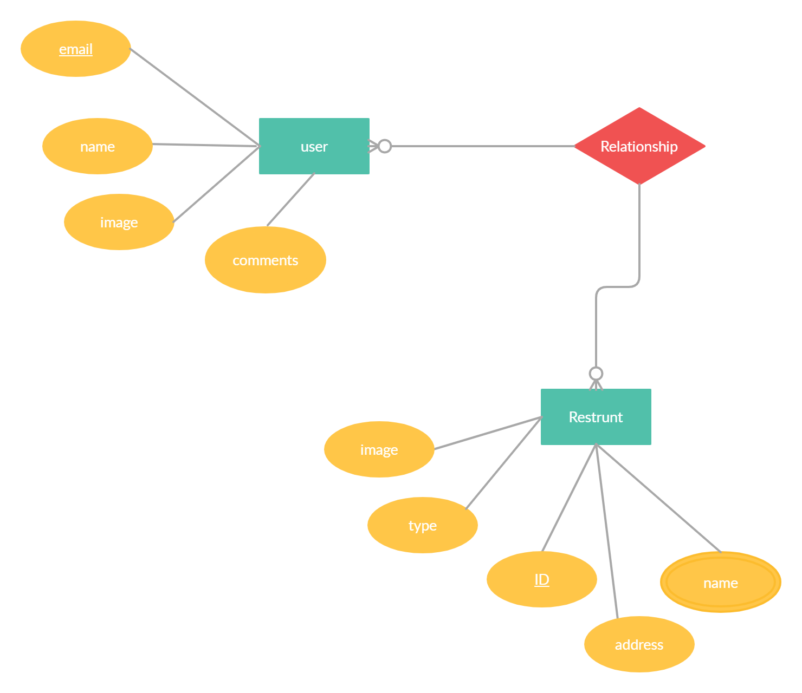

# RestuRater-Frontend


* **Group members** : 
```
1- Heba Al-momani
2- Mahmoud Abubaker
3- Amneh Al-Momany
4- Raghad Alboriny
```


1- **What is the vision of this product?**

`A website that contains a variety categories of restarunt types which provide you with a short description for each restarunt, and you can add your feedback.`

2- **What pain point does this project solve?**

`It guides people to different types of restarunt,To be able to try new types of restaurants .`


3- **Why should we care about your product?**

```
1- The web app will provide information to the users about all the different restarunt in the area
2- Each shop will contain reviews of the customer’s experiences
```


* **Software requirements :**
```
1- A valid JSON file that contains a] number restarunt of  with their tile, images, descriptions,addresses, etc..

2- React Bootstrap.

3- Mongo.

4- Heroku.

5- Nelify.
```

* **USER STORIES** :
```
1- As a user, I want to add feedback for any restarunt in the list.
2- As a user, I want a page where I can find all my targeted restarunt type.
3- As a user, I want to interact with other restarunt card.
5- As a user, I want to have my own profile.
```

* **Wire frame** [click here](https://miro.com/app/board/o9J_l27rkZ0=/)

* **Domain Modeling:**


